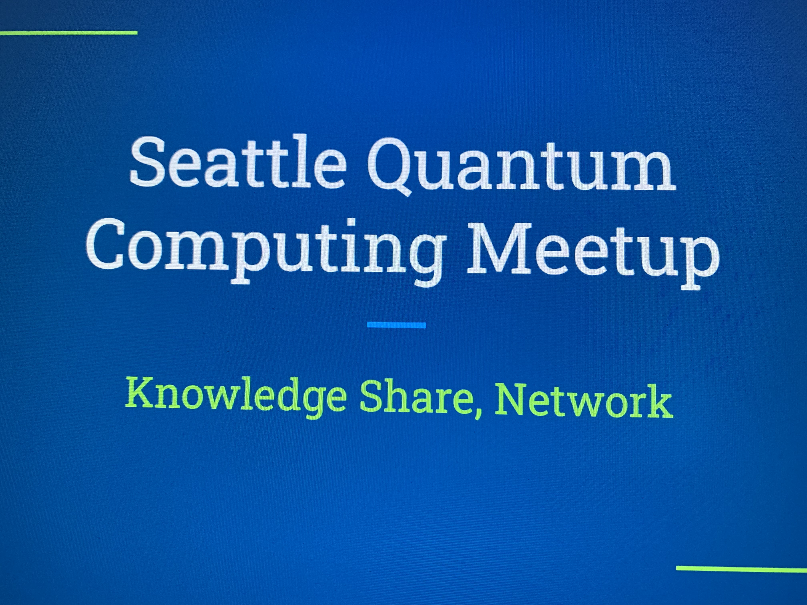

&nbsp;&nbsp;&nbsp;&nbsp;&nbsp;&nbsp;&nbsp;&nbsp;&nbsp;&nbsp;&nbsp;&nbsp; 

<!--  -->

# Qiskit Fall Fest 2025 - 100 Years of Quantum Mechanics
Sponsored by IBM Quantum, Implemented by the Seattle Quantum Computing Meetup

### Schedule of Events:

| Date | Time | Activity | Location |
| :------------------------ | :---------- | :----------------------------------------------------------- | :---------------------------------- |
| Sep 30 | 6-7:30pm PT | <a href="https://www.meetup.com/seattle-quantum-computing-meetup/events/310961270/?eventOrigin=group_upcoming_events" target="_blank">Fall Fest 2025 Prep - Qiskit and Quantum Computing 101</a> | Northgate Branch, Seattle Public Library |
| Oct 4 | 12:30-2:00pm PT | <a href="https://www.meetup.com/seattle-quantum-computing-meetup/events/310960237/?eventOrigin=group_upcoming_events" target="_blank">Qiskit Coding Challenges, Hackathon Prompts, Game Day</a> | Montlake Branch, Seattle Public Library |
| Oct X (TBD) | ~7:00pm PT | Speaker on Quantum Computing | UW Campus (potentially, TBD) |
| Nov 3 | 10:00 am PT | Deadline for Coding Challenges and Hackathon Work | submit online | 
| By Dec 1 | 11:59 pm PT | Certificates of Participation and Excellence Will Be Awarded | delivered online | 

### How it Works:
You can earn a certificate from IBM Quantum while gaining skills in Quantum Computing using Qiskit.

We have Qiskit Coding Challenge Jupyter Notebooks and Hackathon Prompts for you to work on in-person, if you choose, and on your own remotely between Oct. 1 - Nov. 3, 2025.  You can work together in a group, or individually.    

### Criteria for Certificates:

| Certificate Type | Criteria for Awarding | 
| :---------------------- |:----------------------------|
| Certificate of Participation | Submit a completed Qiskit Beginner or Intermediate Notebook by Nov. 3, 10am PT or attend the FF pre-Kickoff or Kickoff in-person on 10/4 at the Montlake Branch of the SPL| 
| Certificate of Excellence | Submit the Qiskit Beginner and Intermediate Notebooks or Submit work on one of the Hackathon prompts by Nov. 3, 10am PT |

