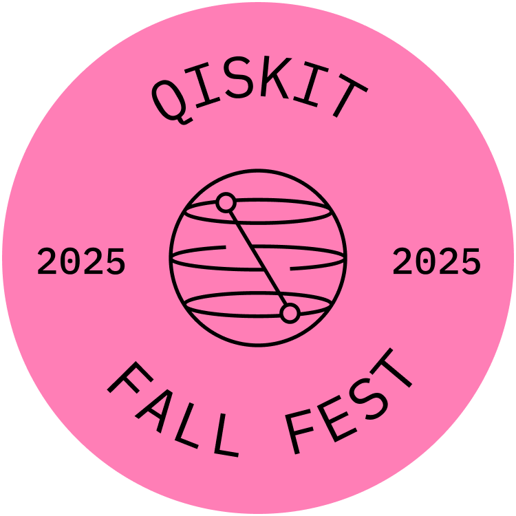
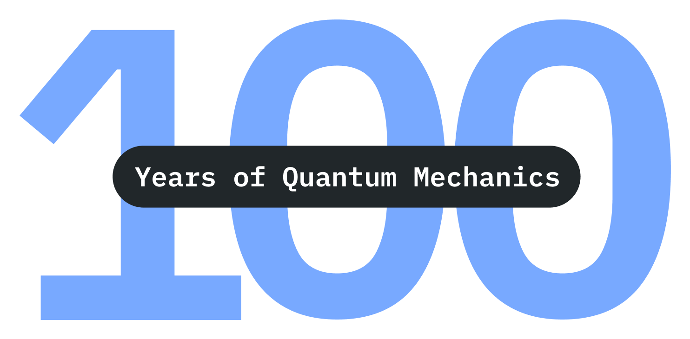
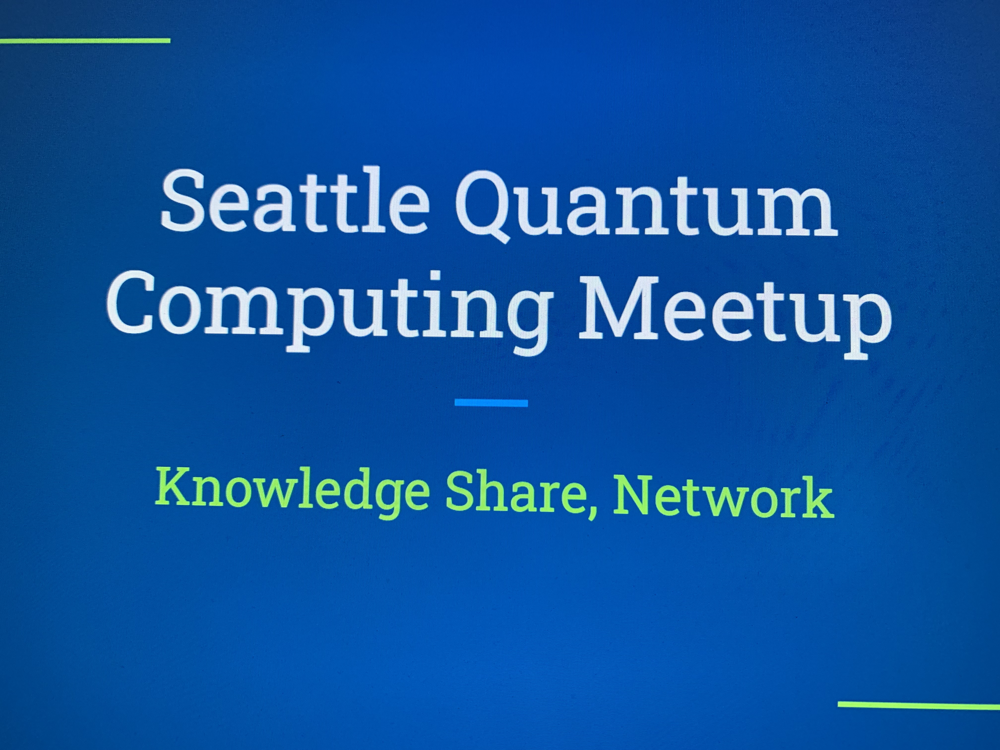
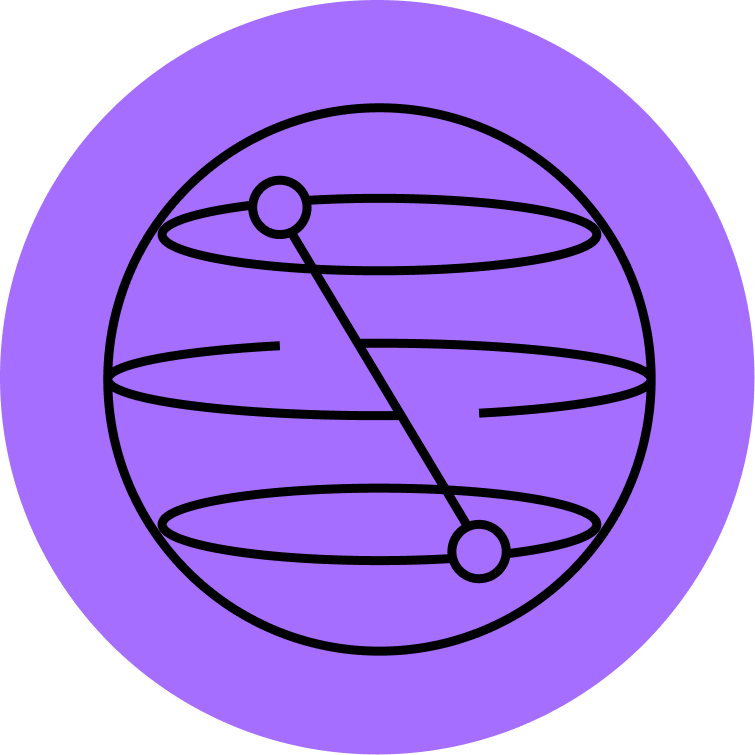
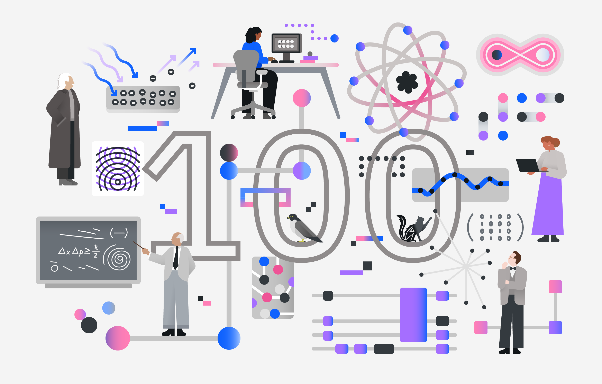

&nbsp;&nbsp;&nbsp;&nbsp;&nbsp;&nbsp;&nbsp;&nbsp;&nbsp;&nbsp;&nbsp;&nbsp; 

<!--  -->

# Qiskit Fall Fest 2025 - 100 Years of Quantum Mechanics
Sponsored by IBM Quantum, Implemented by the Seattle Quantum Computing Meetup

### Schedule of Events:

| Date | Time | Activity | Location |
| :------------------------ | :---------- | :----------------------------------------------------------- | :---------------------------------- |
| Sep 30 | 6-7:30pm PT | <a href="https://www.meetup.com/seattle-quantum-computing-meetup/events/310961270/?eventOrigin=group_upcoming_events" target="_blank">Fall Fest 2025 Prep - Qiskit and Quantum Computing 101</a> | Northgate Branch, Seattle Public Library |
| Oct 4 | 12:30-2:00pm PT | <a href="https://www.meetup.com/seattle-quantum-computing-meetup/events/310960237/?eventOrigin=group_upcoming_events" target="_blank">Qiskit Coding Challenges, Hackathon Prompts, Game Day</a> | Montlake Branch, Seattle Public Library |
| Oct 8 | 6:00-8:00pm PT | <a href="https://www.meetup.com/seattle-quantum-computing-meetup/events/311224681/?eventOrigin=group_upcoming_events" target="_blank">Quantum Computing Monthly Meetup</a> | Stoup Brewing, Capitol Hill |
| Oct 11 | 1:00-3:00pm PT | <a href="https://www.meetup.com/seattle-quantum-computing-meetup/events/311412887/?eventOrigin=group_upcoming_events" target="_blank">Qiskit Fall Fest Work Party</a> | Montlake Community Center |
| Oct 18 | 2:00-4:00pm PT | <a href="https://www.meetup.com/seattle-quantum-computing-meetup/events/311497129/?eventOrigin=group_upcoming_events" target="_blank">Qiskit Fall Fest, Physics Nobel, and Quantum Applications</a> | Montlake Branch, Seattle Public Library |
| Oct 25 | 3:30-5:30pm PT | <a href="https://www.meetup.com/seattle-quantum-computing-meetup/events/311606105/?eventOrigin=group_upcoming_events" target="_blank">Qiskit Challenge Beginner Notebook</a> | Lake City Branch, Seattle Public Library |
| Oct 28 | 6:00-7:30pm PT | <a href="https://www.meetup.com/seattle-quantum-computing-meetup/events/311637046/?eventOrigin=group_upcoming_events" target="_blank">Qiskit Challenge Beginner Notebook</a> | Zoom, RSVP on Meetup to get/see the link |
| Nov 1 | 2:00 pm - 4:00 pm PT| <a href="https://www.meetup.com/seattle-quantum-computing-meetup/events/311658242/?eventOrigin=group_events_list" target="_blank">Last IRL Festival Event </a> | Montlake Branch, Seattle Public Library|
| Nov 19 | 8:00 am - 3:30 pm PT| <a href="https://luma.com/sxwd8icd" target="_blank">TechAlliance Policy Matters Summit: The Quantum Frontier</a> | South Seattle, tickets $150 | 
| Nov 24 | 10:00 am PT | Deadline (Extended!!!) for Coding Challenges and Hackathon Work | submit online | 
| Nov 25 | 6:00 am PT | Closing Ceremony, by Serena Godwin from IBM Quantum | Crowdcast/Zoom, will share link when it becomes available | 
| Up to Early Dec | 11:59 pm PT | Participation and Winner Certificates Will Be Awarded | delivered online, asap after the requirements are satisfied | 

### How it Works:
You can earn a certificate from IBM Quantum while gaining skills in Quantum Computing using Qiskit.

We have Qiskit Coding Challenge Jupyter Notebooks and Hackathon Prompts for you to work on in-person, if you choose, and on your own remotely between Oct. 1 - Nov. 3, 2025.  You can work together in a group, or individually.    

### Criteria for Certificates:

| Certificate Type | Criteria for Awarding | 
| :---------------------- |:----------------------------|
| Participation Certificate | Submit a completed Qiskit Beginner or Intermediate Notebook by Nov. 3, 10am PT or attend at least one of the FF in-person meetings: 9/30, 10/4, 10/11, or any other one that might still be added. | 
| Winning Certificate       | Submit completed versions of the Qiskit Beginner and Intermediate Notebooks or Submit work on one of the Hackathon prompts or on a project of your own design by Nov. 3, 10am PT |

### How to Submit your work?

Submit your work by sending a direct message in Discord (nhawkins), Meetup (Natalie Hawkins), or LinkedIn (natalie-hawkins-seattle) or an email to nrhawkins@gmail.com with ONE of the following, as well as indicating your full name as you wish it to appear on the certificate:
- a link to a github repo or other storage location, like Box, containing your work
- attach your file(s) to the message

### Learning Materials 
You can check the SeattleQuantumComputingMeetup `sqcm_education_and_getting_started` and `qiskit_fall_fest_2025` repos for the presentation materials from our in-person meetups:
- 10/4: [Qiskit Fall Fest 2025 Attendee Guide](https://github.com/SeattleQuantumComputingMeetup/qiskit_fall_fest_2025/blob/main/SQCM_Qiskit_Fall_Fest_2025_Attendee_Guide.pdf)
- 9/30: [Qiskit and Quantum Computing 101 plus](https://github.com/SeattleQuantumComputingMeetup/getting-started/blob/main/Qiskit_and_QuantumComputing_101plus.ipynb)
- 9/16: [How to Get Started in Quantum Computing](https://github.com/SeattleQuantumComputingMeetup/getting-started/blob/main/How_To_Get_Started_In_Quantum_Computing.ipynb)
- 9/16: [Poster - How to Get Started in Quantum Computing](https://github.com/SeattleQuantumComputingMeetup/getting-started/blob/main/poster_How_to_Get_Started_with_Quantum_Computing.pdf)
  
### Final Words

Have fun, enjoy your Quantum Journey, and thanks so much for participating!! 

 

